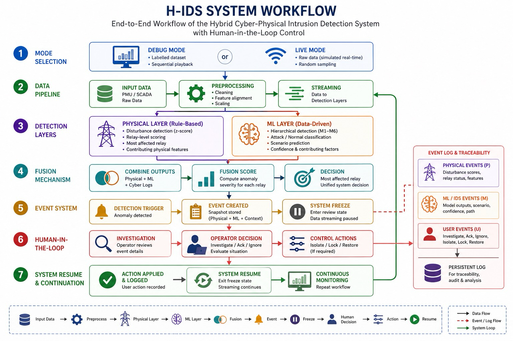
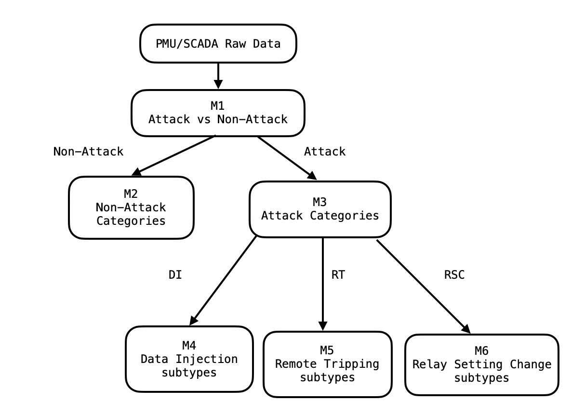
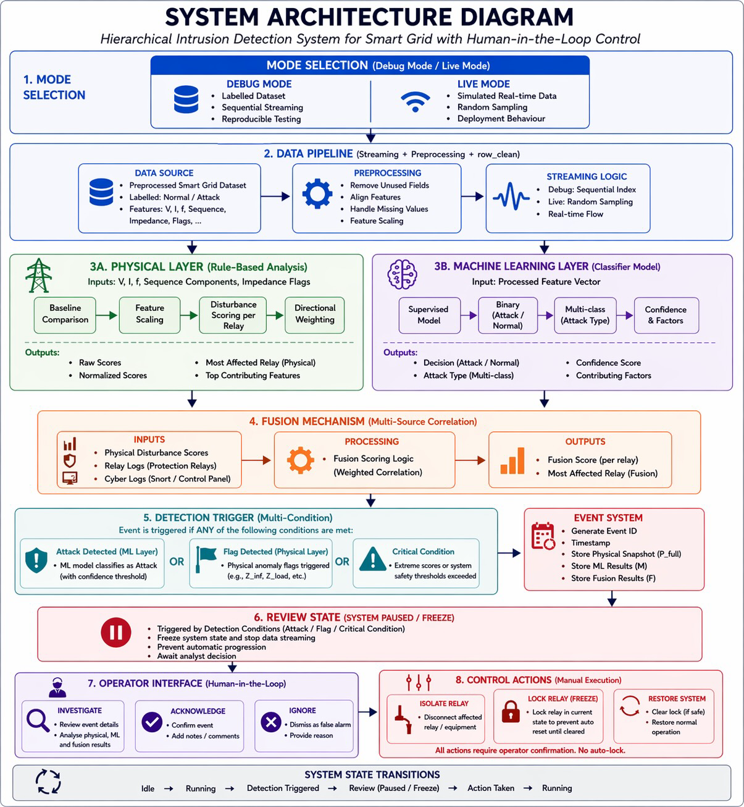

# ⚡ Interactive Explainable AI for Cyber-Attack Detection in Power Systems  

### Hybrid Cyber-Physical Intrusion Detection System (H-IDS)
A safety-critical, human-in-the-loop cyber-physical intrusion detection system for smart power grids.
---

## 📖 Overview

The Hierarchical Intrusion Detection System (H-IDS) is a cyber-physical 
monitoring platform designed for power grid systems.

It integrates physical disturbance analysis, machine learning detection, 
and interactive operator control into a unified real-time dashboard.

Developed as part of a research project, the system simulates and analyses 
cyber-physical attacks in smart grids.

It follows a human-in-the-loop design, where detection decisions are 
validated and controlled by an operator before system continuation.

The platform supports decision-making in safety-critical environments 
rather than fully automating control actions.

This approach demonstrates how AI can be safely integrated into critical 
infrastructure by combining automated detection with controlled human oversight.

## 🔗 System Workflow



---


## 🚀 Key Contributions

- Hybrid cyber-physical intrusion detection framework  
- Fusion-based anomaly scoring for relay-level analysis  
- Human-in-the-loop decision support with controlled intervention  
- Event-driven system with freeze-and-review mechanism  
- Explainable AI outputs for operational transparency
- Safe AI deployment framework for critical infrastructure environments    

## 📊 Dataset

The system uses PMU-based power system data derived from simulated scenarios.  

Cleaned datasets are used for model training and Debug Mode.  
Raw data is used in Live Mode to simulate real-time conditions.

---

## 🎯 Key Objectives

- Detect abnormal behaviour in power grid data  
- Identify the most affected relay (physical impact)  
- Classify attack scenarios using machine learning  
- Provide real-time visualisation and explainability  
- Enable human-in-the-loop decision-making  

---

## 🧩 System Components

### 1. Data Pipeline
- Handles Debug and Live modes  
- Loads and processes PMU-based datasets  
- Controls data streaming behaviour  

---

### 2. Physical Layer
- Computes disturbance scores for each relay  
  using a baseline statistical model  
- Compares real-time measurements with baseline system conditions  
  (z-score deviation)  
- Simulates grid state (relay, breaker, line, bus, generator)  
- Provides explainable system behaviour through contributing features  

---

### 3. Machine Learning Layer
- Performs hierarchical attack detection and classification (M1–M6)  
- M1 acts as a gating model (normal vs attack)  
- Includes a fallback mechanism for low-confidence predictions  
- Outputs probabilistic confidence, scenario classification, and contributing factors for explainability   
- Ensures consistent feature alignment during inference  


📄 Detailed ML explanation → `ML_SYSTEM.md`
---

### 4. Fusion Layer
- Combines physical disturbance analysis with ML predictions  
- Incorporates relay signals and cyber logs  
  for decision support  
- Determines the most affected relay  
- Produces a unified system decision  
- Computes fusion scores to quantify anomaly severity  

---

### 5. Event System
- Tracks system activity as structured events:
  - Physical (P)
  - IDS / ML (M)
  - User Actions (U)
- Enables traceability and explainability  
- Implements a freeze-and-review mechanism to enable safe investigation  

- Upon anomaly detection:
  - The system generates a structured event
  - The system enters a **frozen review state**
  - Data streaming is paused
  - The current event is preserved and not overwritten
  - No new events are created until operator action

This ensures stable investigation and prevents loss of context during analysis.

---

## 🏗 System Architecture



---


### 6. User Interface
- Built with Streamlit  
- Provides interactive monitoring dashboard  
- Supports investigation, acknowledgement, and operator control actions 

📄 Full system design → `SYSTEM_ARCHITECTURE.md`

---

## 🧪 Operating Modes

### Debug Mode
- Uses labelled dataset  
- Sequential playback  
- Deterministic behaviour  
- Ideal for testing and validation  

### Live Mode
- Uses the same dataset but treats it as raw input  
- Bypasses pre-cleaned datasets  
- Passes data through preprocessing (`engine.preprocessing`)  
- Simulates real-world streaming conditions  
- Produces non-deterministic behaviour via random sampling  
- Maintains current sample during system freeze to ensure stable visualisation  

### Scenario Representation

The system maintains a unified `scenario` concept with mode-dependent meaning:

- Debug Mode:
  - Scenario represents the ground truth label from the dataset

- Live Mode:
  - Scenario represents the predicted class from the ML model
  - No ground truth is available during runtime

This ensures consistency in logging and UI display while maintaining realistic system behaviour.

---

## 🚀 How to Run

### 1. Install dependencies
```bash
pip install -r requirements.txt
```

### 2. Start the application
```bash
streamlit run app.py
```

### 3. Select mode
- Debug Mode → controlled simulation  
- Live Mode → simulated real-time behaviour  

---

## 🖥 Key Features

### 📊 Visualisation
- Interactive grid (relay, breaker, line, bus, generator)  
- Real-time PMU waveform plotting (Phase A, B, C)  

### ⚡ Physical Monitoring
- Voltage, Current, Frequency  
- Sequence components (Positive, Negative, Zero)  
- Impedance anomaly detection  

### 🤖 Detection System
- Machine learning-based intrusion detection  
- Scenario classification and confidence scoring  
- IDS alert panel with real-time alerts  

### 📋 Event System
- Real-time event logging  
- Multi-layer event breakdown (Physical / IDS / User)  
- Investigation modal with detailed insights  

### 🛠 Operator Actions
- Isolate → Disconnect affected relay from system  
- Lock → Force relay into fault/locked state  
- Restore → Return relay to normal operation  
- Acknowledge (Ack) → Confirm and log IDS alert  
- Ignore → Dismiss alert and resume system operation  
- Investigate → Open detailed event analysis popup

---

## 🔗 System Workflow

```
Input Data → Physical Analysis + ML Detection → Fusion → Event → UI ↔ User Actions
```

---

## 📁 Project Structure

```
FYP/

├── engine/                # Core system logic (ML, physical layer, fusion)
├── helpers/               # Event handling and logging utilities
├── ui/                    # UI components (dashboard elements, modal, styles)
├── pages/                 # Streamlit pages (main dashboard)

├── data/
│   ├── merged/            # Main datasets used during runtime
│   ├── datasets_hierarchical/   # Cleaned datasets for ML training
│   ├── baseline/          # Baseline values for physical comparison
│   └── original/          # Raw datasets (reference only)

├── models/
│   ├── M1.joblib          # Primary ML model for detection
│   ├── feature_columns.pkl # Feature schema for inference alignment
│   ├── physical_baseline.pkl # Baseline system reference for physical layer
│   └── build_physical_baseline.py   # Generates baseline model (scaler, thresholds, stats)

├── notebook/              # Development notebooks (EDA, training)

├── image/                 # Diagrams and UI screenshots (README visuals)
│   ├── workflow.png
│   ├── architecture.png
│   ├── ml_hierarchy.png
│   └── dashboard.png

├── app.py                 # Application entry point
├── README.md              # Project overview and usage
└── requirements.txt       # Dependencies
```

---

## 📦 Model Artifacts (Overview)

- `feature_columns.pkl`  
  Ensures consistent feature ordering and alignment between training and inference  

- `physical_baseline.pkl`  
  Contains baseline system conditions used by the physical layer to detect deviations and construct system state  

📄 Full explanations are provided in:
- `ML_SYSTEM.md`
- `SYSTEM_ARCHITECTURE.md`

---

## ⚠️ Known Behaviour

- System pauses during investigation (by design)  
- Upon attack detection, the system enters a review state 
  and remains paused until operator action is taken  
- Live mode may generate rapid event streams  
- Streamlit reruns may cause UI refresh behaviour  
- Import reload issues may occasionally appear during development  
- Events are persistent during investigation and will not be overwritten  
- The system prevents new event generation while in frozen state  

---

## 🧠 Design Philosophy

- Safety-first: avoids unsafe automated decisions  
- Human-in-the-loop: operator validates all critical actions  
- Explainability: decisions supported by interpretable features  
- Hybrid intelligence: combines physical reasoning with machine learning  


## 📌 Notes

- Live Mode does NOT use true real-time data  
- Instead, it simulates real-world conditions by:
  - Using unprocessed dataset samples  
  - Passing them through a preprocessing pipeline  

- The system separates:
  - Detection (ML layer)  
  - Physical reasoning (disturbance analysis)  

- This improves:
  - Interpretability  
  - Reliability  
  - Traceability of system decisions  

- The hybrid design combines:
  - Data-driven ML detection  
  - Physics-based system validation  

---

## 📚 Documentation

- 🤖 Machine Learning Module → `ML_SYSTEM.md`  
- ⚡ System Architecture → `SYSTEM_ARCHITECTURE.md`  

---

## 👩‍💻 Author

Final Year Project — Cyber-Physical Intrusion Detection System

---

This system demonstrates how AI can be safely integrated into critical infrastructure by combining automated detection with controlled human oversight.